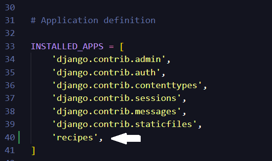
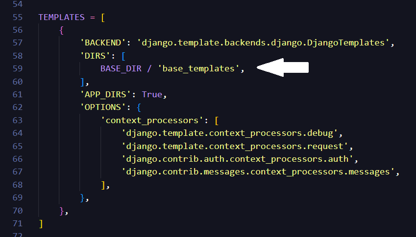
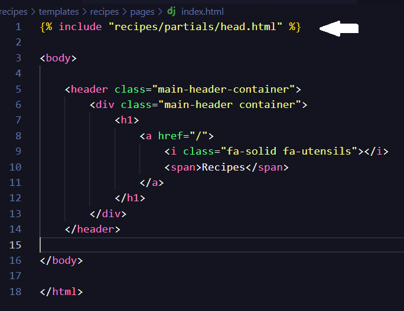
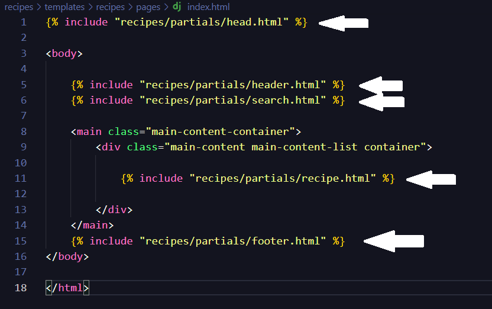
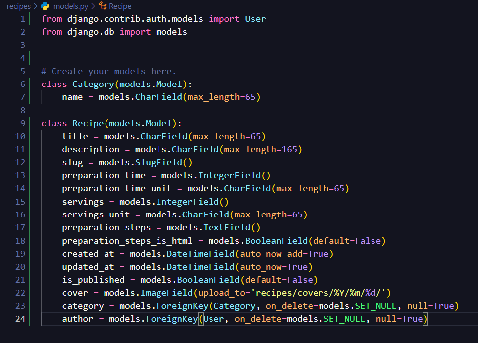
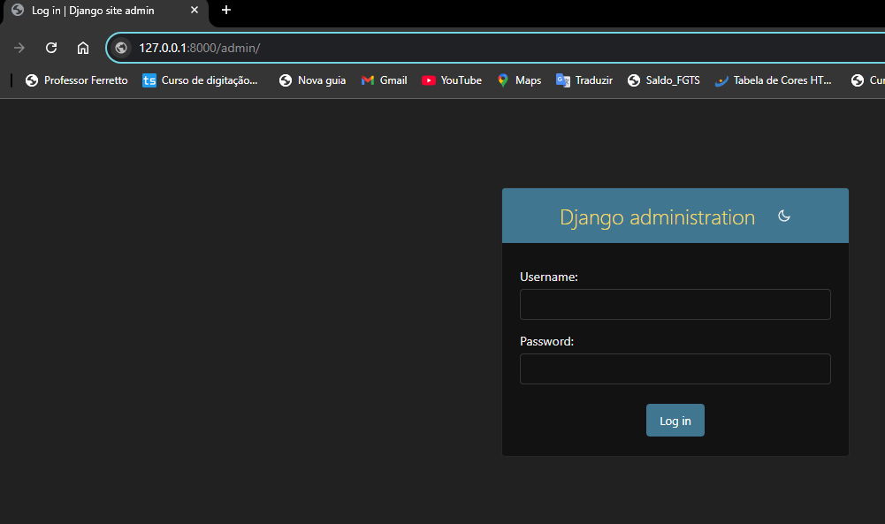
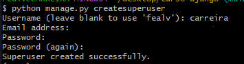

# Curso-Django

Tópicos aprendidos:

- Adcionando .gitignore;
  > **_.gitignore pego na internet_**
- Criando ambiente virtual;
  > _python -m venv venv_
- Baixando o Django;
  > _pip install django_
- Criando o Projeto;
  > _django-admin startproject_
- Criando o app recipes;
  > _python manage.py startapp recipes_
- Colocar o nome do app no arquivo _settings.py_;
  
  

- Criado pasta _base_templates_ e adicionado o caminha no arquivo _settings.py_;

  

- Separando o _Head_ da página e incluindo na _index.html_;
  > __

  

- Incluindo o contaúdo do _index.html_ com _include_;
   > __

  

- Criado models.py;

  

- Aplicando migrações;
  > _python manage.py migrate_  
  > _python manage.py makemigrations_  
  > _python manage.py migrate_  

- Criar Super usuário;
  > _python manage.py createsuperuser_

  

  

  